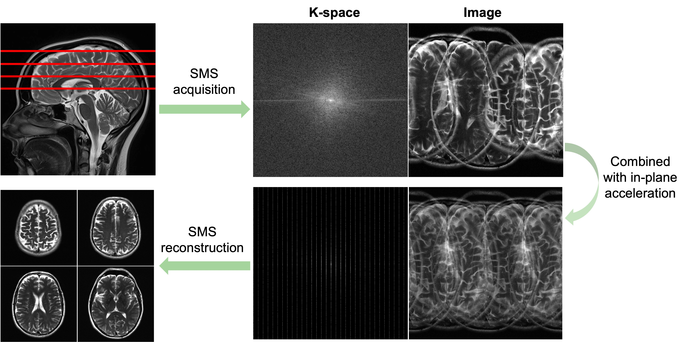
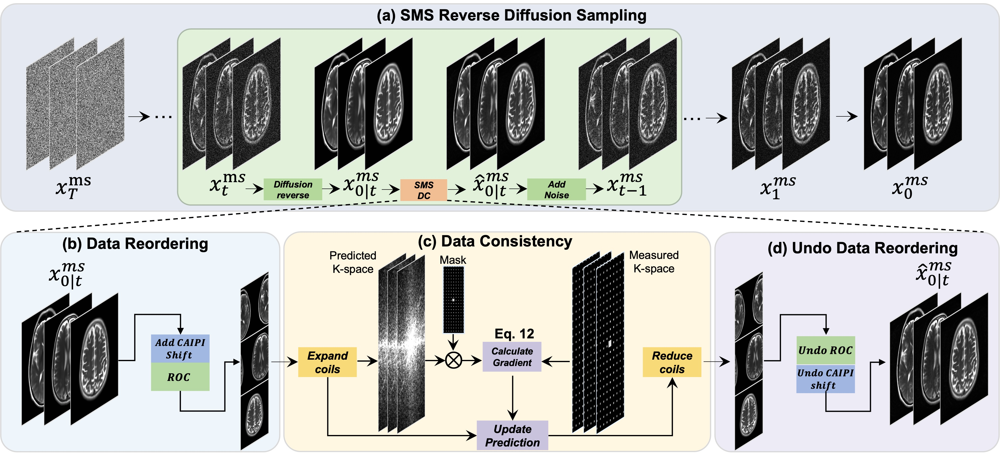
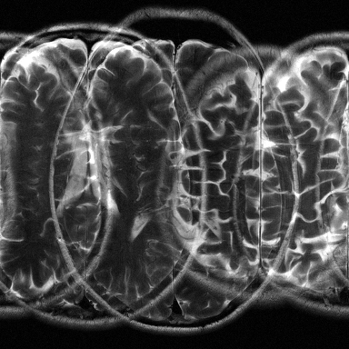
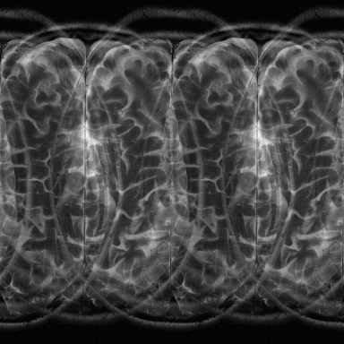
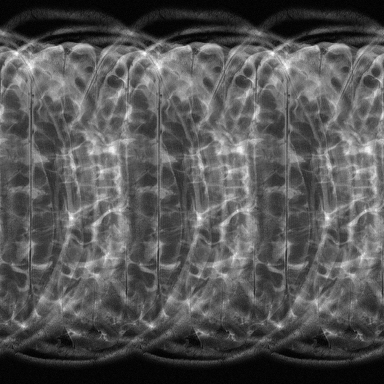
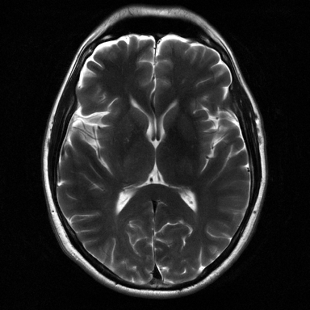

# ROGER
👏👏 [Robust Simultaneous Multislice MRI Reconstruction Using Deep Generative Priors](https://arxiv.org/abs/2407.21600)

## Simultaneous Multislice Reconstruction
<div align="center">
  
</div>
<br>
Fig.1 Illustration of the simultaneous multislice (SMS) MRI sampling and reconstruc- tion process. The acquisition involves multiple non-adjacent slices with CAIPI (controlled aliasing in parallel imaging) shift patterns and additional in-plane acceleration, resulting in sparse k-space and complex aliasing artifacts. The reconstruction of slices is difficult due to these strong aliasing artifacts and the absence of fully-sampled autocalibration sig- nals in many SMS-accelerated sequences.

## Methodology
<div align="center">
  
</div>
<br>
Fig.2 Schematic illustration of the proposed ROGER method. More details can be found in paper.

## Releases
Prospectively accelerated dataset and generative model weight are released at [Google Drive](https://drive.google.com/drive/folders/1dekG6Ya1crYhSpL3qJKEszfLDsB4_4z_?usp=sharing)

## Data preprocess
Method for getting retrospectively accelerated brain dataset from [fastMRI](https://fastmri.med.nyu.edu):
```
fastMRI_data_preprocess.ipynb
```

## Inference
Before inference, the data should be saved in 'npz' format like:
```
readout_data        = data['readout_data']
readout_calibration = data['readout_calibration']
readout_csm         = data['readout_csm']
shifts              = data['shifts']
```

``` bash
python infer.py --input meas_MID00273_FID03217_TSE_SMS_334_SMS_data_slice0.npz --output recon_MB3R3.npz --MB 3 --R 3 --chk 384x384_ema_0.9999_200000.pt 
```

## Reconstruction
<table border="1" cellspacing="10" cellpadding="10">
  <tr>
    <th>Sampling setting</th>
    <th>Mask</th>
    <th>SMS Image</th>
    <th>Recon</th>
    <th>GT</th>
  </tr>
  <tr>
    <td>
      MB4R1
    </td>
    <td>
         
    </td>
    <td>
        
    </td>
    <td>
        
    </td>

  </tr>
  <tr>
    <td>
      MB4R2
    </td>
    <td>
         
    </td>
    <td>
        
    </td>
    <td>
        
    </td>
    <td>
        
    </td>
  </tr>
  <tr>
    <td>
      MB4R3
    </td>
    <td>
         
    </td>
    <td>
        
    </td>
    <td>
        
    </td>
    
  </tr>
</table>


## Citation
```
@article{huang2024robust,
  title={Robust Simultaneous Multislice MRI Reconstruction Using Deep Generative Priors},
  author={Huang, Shoujin and Luo, Guanxiong and Wang, Yuwan and Yang, Kexin and Zhang, Lingyan and Liu, Jingzhe and Guo, Hua and Wang, Min and Lyu, Mengye},
  journal={arXiv preprint arXiv:2407.21600},
  year={2024}
}
```
