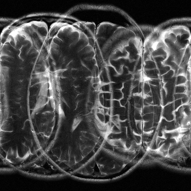

# ROGER
👏👏 [Robust Simultaneous Multislice MRI Reconstruction Using Deep Generative Priors](https://arxiv.org/abs/2407.21600)

The code will come soon.

## Reconstruction
<table border="1" cellspacing="10" cellpadding="10">
  <tr>
    <th>Sampling setting</th>
    <th>Mask</th>
    <th>SMS image</th>
    <th>Recon</th>
    <th>GT</th>
  </tr>
  <tr>
    <td>
      MB4R1<br><br><br>
      MB4R1<br><br><br>
      MB4R1
    </td>
    <td>
        
        
        
    </td>
    <td>
        
        
        
    </td>
    <td>
        
        
        
    </td>
    <td>
        
    </td>
  </tr>
</table>


## Citation
```
@article{huang2024robust,
  title={Robust Simultaneous Multislice MRI Reconstruction Using Deep Generative Priors},
  author={Huang, Shoujin and Luo, Guanxiong and Wang, Yuwan and Yang, Kexin and Zhang, Lingyan and Liu, Jingzhe and Guo, Hua and Wang, Min and Lyu, Mengye},
  journal={arXiv preprint arXiv:2407.21600},
  year={2024}
}
```
