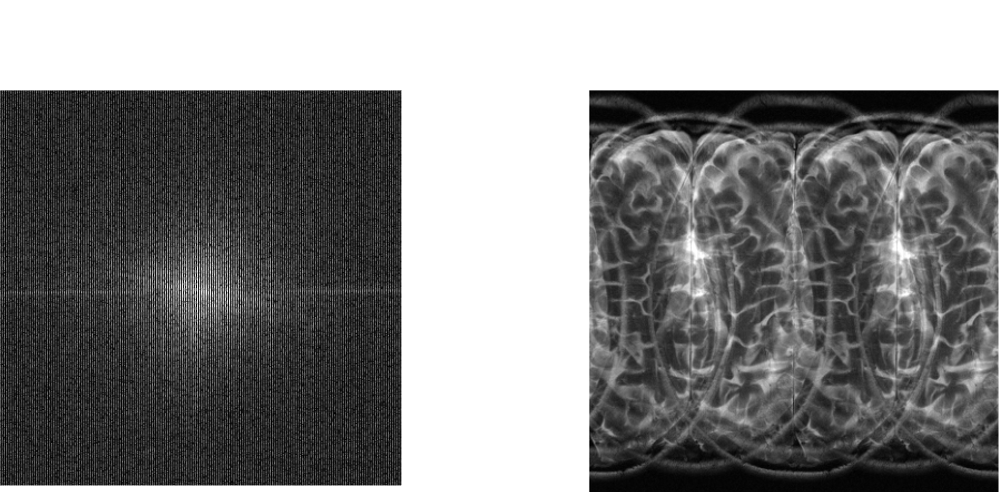
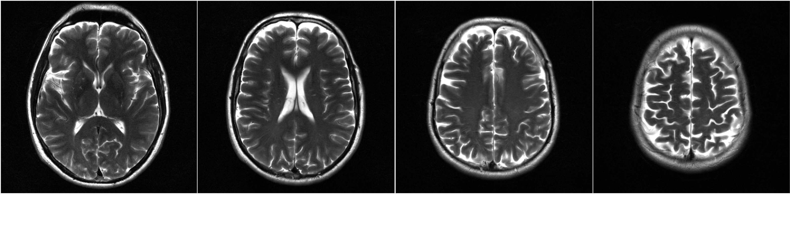

# ROGER
👏👏 [Robust Simultaneous Multislice MRI Reconstruction Using Deep Generative Priors](https://arxiv.org/abs/2407.21600)

The code will come soon.

<table>
  <tr>
    <td>
        SMS K-space
    </td>
    <td>
        SMS imgae
    </td>
    <td>
       Recon
    </td>
    <td>
       GT
    </td>
    
  </tr>
  <tr>
    <td>
        
    </td>
    <td>
        
    </td>
    <td>
        
    </td>
    <td>
        
    </td>
  </tr>
</table>

## SMS reconstruction
### Raw data ###
<div align="center">
  
</div>

### Reconstruction ###
<div align="center">
  
</div>

## Citation
```
@article{huang2024robust,
  title={Robust Simultaneous Multislice MRI Reconstruction Using Deep Generative Priors},
  author={Huang, Shoujin and Luo, Guanxiong and Wang, Yuwan and Yang, Kexin and Zhang, Lingyan and Liu, Jingzhe and Guo, Hua and Wang, Min and Lyu, Mengye},
  journal={arXiv preprint arXiv:2407.21600},
  year={2024}
}
```
